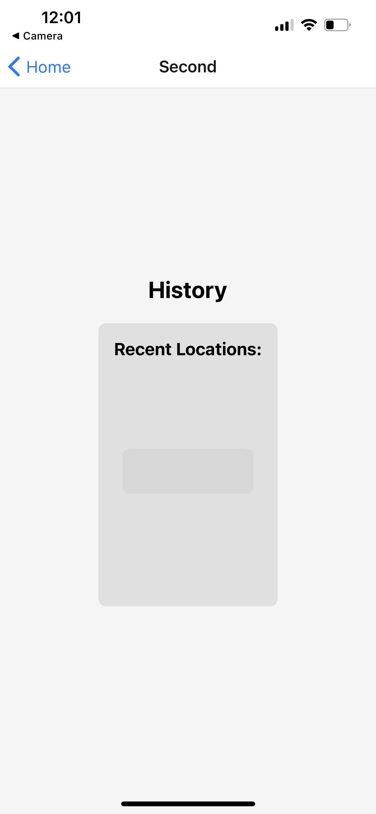

# LAB - React Native - Milestone 2: Polish and Delivery
Complete the work on your phone application.

You will be presenting your application live to your class

## Assignment Recap
Create your first Phone App. What it does and how it looks is up to you.

### Application Requirements

- Use 2 screens / components
- Use and share state between components/screens
- Use at least 1 native device feature (Contacts, Camera, GPS, etc)
- Properly Documented for End Users
- Live Demo & Presentation

## Milestone 2 - Product Delivery (This Lab)

As you complete your RNA, switch your focus to the user experience.

- Quality and Thoughtful Styling using css-in-js
- Right sized tap targets, good contrast
- Dark and Light Modes
- Well thought through UX
  - Be considerate of individuals that primarily use their thumbs, left or right hands

## User Stories

- User Story 1: Display Current Location
As a user, I want to see my current location displayed in the app so that I can easily determine my coordinates.

- Acceptance Criteria:

  - When I open the app, it should request permission to access my device's location.
  - Once I grant permission, the app should retrieve and display my current latitude and longitude.
  - The displayed location should update dynamically as I move to different locations.
  - If the app is unable to access my location or permission is denied, it should display an appropriate error message.

- User Story 2: Location Tracking
As a user, I want the app to continuously track my location so that I can view my real-time movement on a map.

  - Acceptance Criteria:

  - The app should continuously track and update my location as I move.
  - It should display my current location on a map, allowing me to see my position visually.
  - The map should update in real-time to reflect any changes in my location.
  - If there is an issue with the location tracking, such as a loss of GPS signal, the app should display a message indicating the problem.

These user stories focus on the core functionality related to GPS in the app. You can further expand these stories or modify them based on your specific app requirements and desired features.

- User Story 1:
As a user, I want to be able to view my last known location on the home screen of the app. This way, I can quickly see where I was located during my last use of the app without having to manually search for it. The location should be displayed prominently and clearly with the latitude and longitude values. Additionally, there should be a refresh button to update the location in case it has changed since the app was last opened.

- User Story 2:
As a user, I want the home screen of the app to provide a visual representation of my last known location using a map. This way, I can have a better understanding of the area and surroundings of the location. The map should be centered on the latitude and longitude coordinates of the last known location, and it should display a marker indicating the exact point. The map should have a suitable zoom level to provide an overview of the area.

### Operating Instructions

1. [Fork Repo](https://github.com/Hcooper23/js-401D53-LAB---React-Native---Milestone-1-MVP) down from GitHub
2. Run NPM i for your system to install all dependencies
3. Run in Terminal expo start or npm start
4. Open your camera function to scan a QR code from the terminal that will open up EXPO Go on mobile device.
5. Phone will detect the exact location of the user and will render and image seen 

## Phone Renderings 

Here is a screen shoot of the map you will see when you first request location.
Here is showing the ability to zoom in as you would on standard Apple Maps. 
This is the history screen. The goal is to have it render the last 5 calls done by the phone for location and list them with no map.
The error I receive when switching to History screen from terminal.